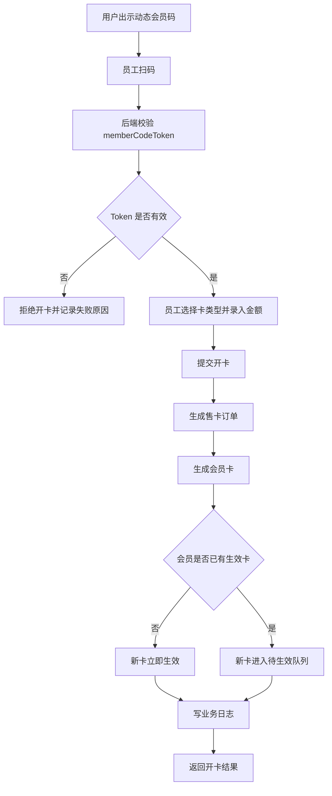
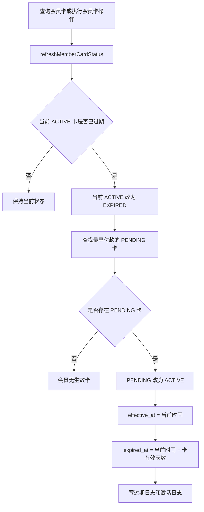
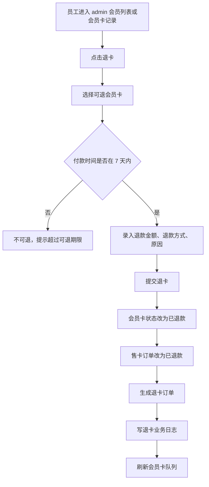

# 会员卡售卖退卡流程

## 业务目标

- 支持会员购买多张卡。
- 同一会员同一时间只允许一张卡生效。
- 待生效卡按付款时间排队。
- 当前生效卡到期后，下一张待生效卡自动接续生效。
- 退卡以付款时间为准 7 天内可退，不以生效时间为准。
- 退卡只允许 admin 后台员工操作。

## 开卡流程

## 卡队列生效流程

## 退卡流程

## 防刷与安全

| 风险 | 控制 |
|---|---|
| 伪造会员码 | 小程序只展示短时效 `memberCodeToken`，后端解码并校验登录用户、会员、过期时间、一次性或短期有效 |
| 重复提交开卡 | 后端用订单号唯一索引、事务、必要时加重复提交拦截 |
| 越权退卡 | 退卡接口只在 admin 后台开放，必须登录且具备 `member:card:refund` 权限 |
| 超期退款 | 后端按 `paid_at` 判断 7 天，不信任前端按钮显隐 |
| 数据不一致 | 开卡、退卡、状态刷新必须在事务内完成并写业务日志 |

## 对账闭环

| 业务动作 | 订单 | 会员卡 | 日志 |
|---|---|---|---|
| 开卡 | 生成售卡订单 | 生成 ACTIVE 或 PENDING 卡 | OPEN、ACTIVATE |
| 到期接续 | 不生成新订单 | 旧卡 EXPIRED，新卡 ACTIVE | EXPIRE、ACTIVATE |
| 退卡 | 生成退卡订单，原售卡订单标记退款 | 卡状态 REFUNDED | REFUND |

## 查询会员状态

查询会员卡、会员详情、会员列表展示当前卡状态前，应先刷新会员卡状态。这样可以避免出现：

- 过期卡仍显示为生效中。
- 下一张已付款卡没有自动接续。
- 会员列表、卡记录、订单对账看到的状态不一致。
