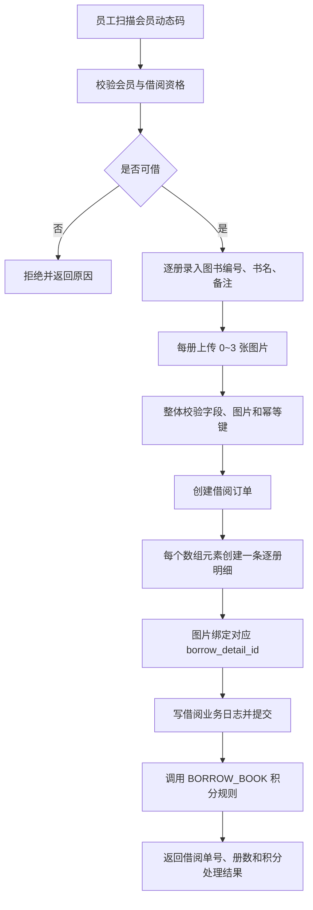
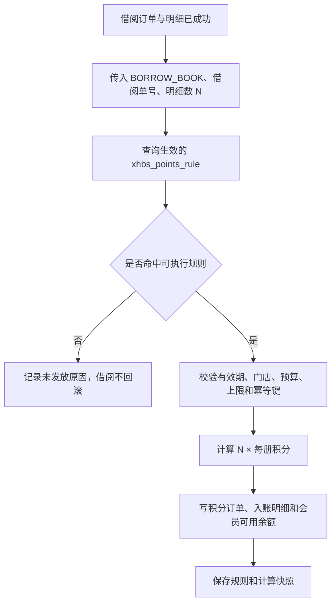
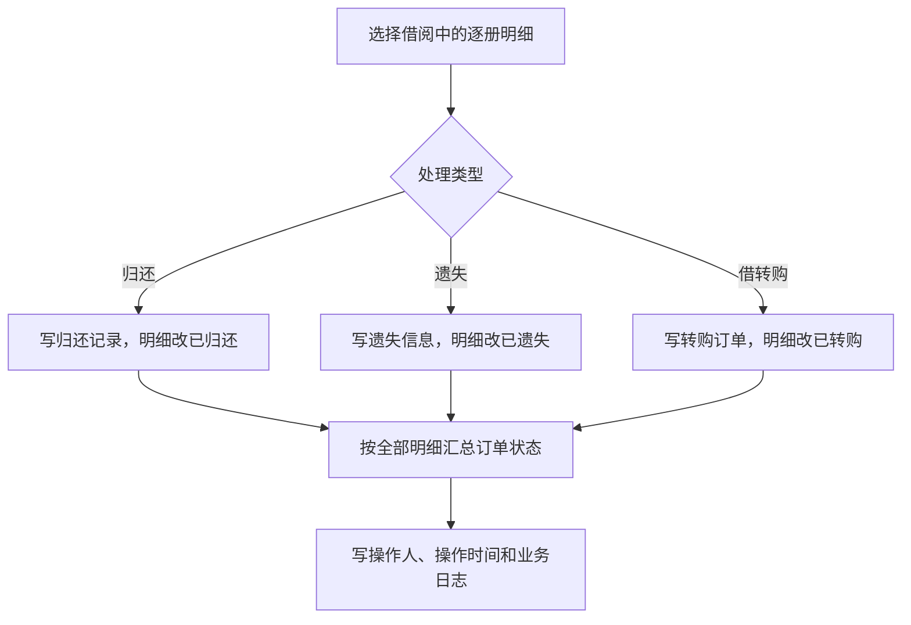

# 借阅流程

> 版本：V2.0
>
> 状态：目标流程，待开发
> 原则：借阅模块不访问 `book_info`、book history 和库存；每册书一条明细，每条最多 3 张图片。

## 1. 借书流程



借阅事务中不包含图书主数据创建、匹配、库存校验、库存扣减和图书历史写入。

## 2. 积分流程



同一借阅单的幂等键为 `BORROW_BOOK:{borrowOrderNo}`。初始规则为每册 10 分，但最终值必须来自规则表。

## 3. 归还、遗失和借转购



- 不修改 `book_info`、库存和 book history。
- 正常归还、遗失和借转购不冲正借阅奖励积分。
- 只有明确的误录撤销才能关联原积分订单冲正。
- 终态明细不得再次处理。

## 4. 状态闭环

```text
单册明细：借阅中 -> 已归还 / 已遗失 / 已转购 / 已取消

订单：
- 全部明细借阅中                       -> 借阅中
- 终态明细与借阅中明细并存           -> 部分处理
- 全部明细进入终态                     -> 已完结
- 全部明细取消或订单未生效          -> 已取消
```

状态闭环只校验订单、逐册明细和处理记录，不包含库存闭环。
