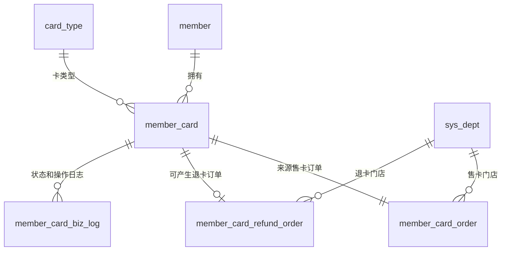

# 会员卡业务表

> 目标：支撑会员卡售卖、卡队列、退卡、订单对账和业务日志追踪。

## 表关系

## member_card 会员卡表

| 字段 | 类型 | 必填 | 说明 |
|---|---|---|---|
| id | bigint PK | 是 | 主键 |
| member_id | int | 是 | 会员 ID |
| card_type_id | int | 是 | 卡类型 ID |
| card_type_name | varchar | 是 | 卡类型名称快照 |
| valid_days | int | 是 | 有效天数快照 |
| sale_amount | decimal | 是 | 售卡实收金额 |
| sale_order_no | varchar | 是 | 售卡订单号 |
| status | tinyint | 是 | 0 待生效，1 生效中，2 已过期，3 已退款 |
| paid_at | datetime | 是 | 付款时间，退款 7 天判断以此为准 |
| effective_at | datetime | 否 | 生效时间 |
| expired_at | datetime | 否 | 到期时间 |
| dept_id | bigint | 是 | 开卡门店 |
| operator_id | bigint | 是 | 操作员工 ID |
| operator_name | varchar | 是 | 操作员工名称 |
| refund_order_no | varchar | 否 | 退卡订单号 |
| remark | varchar | 否 | 备注 |
| created_at | datetime | 是 | 创建时间 |
| updated_at | datetime | 是 | 更新时间 |
| is_del | tinyint | 是 | 逻辑删除 |

## member_card_order 售卡订单表

| 字段 | 类型 | 必填 | 说明 |
|---|---|---|---|
| id | bigint PK | 是 | 主键 |
| order_no | varchar | 是 | 售卡订单号，唯一 |
| member_id | int | 是 | 会员 ID |
| member_card_id | bigint | 是 | 会员卡 ID |
| card_type_id | int | 是 | 卡类型 ID |
| card_type_name | varchar | 是 | 卡类型名称快照 |
| amount | decimal | 是 | 应收金额 |
| pay_amount | decimal | 是 | 实收金额 |
| payment_type | varchar | 是 | 支付方式，当前为员工录入 |
| order_status | tinyint | 是 | 1 已支付，2 已退款 |
| pay_time | datetime | 是 | 付款时间 |
| dept_id | bigint | 是 | 售卡门店 |
| create_staff_id | bigint | 是 | 开单员工 ID |
| create_staff_name | varchar | 是 | 开单员工名称 |
| remark | varchar | 否 | 备注 |
| created_at | datetime | 是 | 创建时间 |
| updated_at | datetime | 是 | 更新时间 |
| is_del | tinyint | 是 | 逻辑删除 |

## member_card_refund_order 退卡订单表

| 字段 | 类型 | 必填 | 说明 |
|---|---|---|---|
| id | bigint PK | 是 | 主键 |
| refund_order_no | varchar | 是 | 退卡订单号，唯一 |
| sale_order_no | varchar | 是 | 原售卡订单号 |
| member_id | int | 是 | 会员 ID |
| member_card_id | bigint | 是 | 会员卡 ID |
| refund_amount | decimal | 是 | 退款金额 |
| refund_type | varchar | 是 | 退款方式 |
| refund_status | tinyint | 是 | 1 已退款 |
| reason | varchar | 是 | 退款原因 |
| refund_time | datetime | 是 | 退款时间 |
| dept_id | bigint | 是 | 退卡操作门店 |
| operator_id | bigint | 是 | 操作员工 ID |
| operator_name | varchar | 是 | 操作员工名称 |
| created_at | datetime | 是 | 创建时间 |
| updated_at | datetime | 是 | 更新时间 |
| is_del | tinyint | 是 | 逻辑删除 |

## member_card_biz_log 会员卡业务日志表

| 字段 | 类型 | 必填 | 说明 |
|---|---|---|---|
| id | bigint PK | 是 | 主键 |
| member_id | int | 是 | 会员 ID |
| member_card_id | bigint | 否 | 会员卡 ID |
| biz_type | varchar | 是 | OPEN、ACTIVATE、EXPIRE、REFUND |
| before_status | tinyint | 否 | 操作前状态 |
| after_status | tinyint | 否 | 操作后状态 |
| biz_order_no | varchar | 否 | 关联售卡或退卡订单号 |
| operator_id | bigint | 否 | 操作人 ID |
| operator_name | varchar | 否 | 操作人名称 |
| remark | varchar | 否 | 操作说明 |
| created_at | datetime | 是 | 创建时间 |
| is_del | tinyint | 是 | 逻辑删除 |

## 闭环校验

| 场景 | 必须落库 | 对账点 |
|---|---|---|
| 开卡 | `member_card`、`member_card_order`、`member_card_biz_log` | 售卡订单实收金额 = 会员卡 sale_amount |
| 激活下一张卡 | 更新旧卡过期、新卡生效，写日志 | 同一会员最多一张 `status=1` |
| 退卡 | 更新会员卡已退款、售卡订单已退款、生成退卡订单、写日志 | 退卡订单关联原售卡订单 |
| 查询会员状态 | 先刷新卡状态，再返回生效卡和待生效卡 | 过期卡不会继续展示为生效中 |
