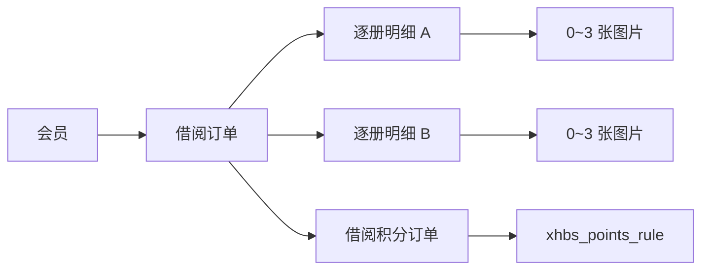

# B01 — 借阅管理

> 版本：V2.0
>
> 状态：本期需求基线，待开发
>
> 适用范围：Admin 借阅记录、员工端办理借阅、归还、遗失、借转购及借阅积分联动

## 1. 本期结论

借阅模块只管理“会员借了哪一册书、该册书当前状态和相关图片”，不管理图书主数据和库存。

1. 不读取、新增或修改 `book_info`/`bookinfo`。
2. 不写入 `book_info_history`或其他 book history 表。
3. 不提供图书 Excel 导入、图书管理、图书联想和 ERP 图书同步。
4. 不维护借阅库存、可借数量或 ERP 数量。
5. 借书时由员工手工填写图书编号和图书名称。
6. 一条借阅明细只代表一册实体书；借同一本书两册时保存两条明细。
7. 每条借阅明细最多关联 3 张图片。
8. 借阅成功后调用统一积分规则服务，不在借阅代码中写死 10 积分。

## 2. 菜单与权限

```text
会员管理
借阅管理
└── 借阅记录
```

本期不建设“图书管理”二级菜单，不配置图书查询和导入权限。

| 权限标识 | 用途 |
|---|---|
| `borrow:record:list` | 查询借阅记录 |
| `borrow:record:query` | 查看订单、逐册明细和图片 |
| `borrow:record:export` | 导出借阅记录 |
| `borrow:record:return` | 办理归还 |
| `borrow:record:lost` | 办理遗失 |
| `borrow:record:purchase` | 办理借转购 |
| `borrow:record:remark` | 修改备注 |
| `borrow:record:image` | 上传、查看借阅明细图片 |

## 3. 核心业务模型



图书编号和书名是借阅发生当时的文本快照，不是图书主表外键。后续修改其他系统中的图书信息，不能改写历史借阅明细。

## 4. 办理借阅

### 4.1 页面交互

1. 员工扫描会员动态码，系统校验会员身份和借阅资格。
2. 点击“添加一册”新增一行，逐册填写图书编号和图书名称。
3. 同一本书借两册时，可复制一行，但提交后必须生成两条明细。
4. 每行可上传 0~3 张图片，可删除、重新上传和预览大图。
5. 页面不提供数量合并输入，不提供图书主数据选择器。

### 4.2 逐册录入字段

| 字段 | 必填 | 规则 |
|---|---:|---|
| `bookCode` | 是 | 员工手工录入；去除首尾空格；按字符串保存，保留前导 0；建议最长 64 字符 |
| `bookName` | 是 | 员工手工录入；去除首尾空格；建议最长 200 字符 |
| `remark` | 否 | 当前这一册书的备注 |
| `imageIds` | 否 | 当前这一册书的图片凭证，最多 3 个 |

服务端不将 `bookCode` 当作全局唯一图书主键。不同借阅单、同一借阅单的不同明细都可以出现相同编号。

### 4.3 提交数据

```json
{
  "books": [
    {
      "bookCode": "0000123456",
      "bookName": "活着",
      "remark": "第一册",
      "imageIds": ["IMG001", "IMG002"]
    },
    {
      "bookCode": "0000123456",
      "bookName": "活着",
      "remark": "第二册",
      "imageIds": ["IMG003"]
    }
  ],
  "remark": "门店借阅"
}
```

`total_book_count` 必须由服务端按 `books` 的有效元素数计算，不信任客户端传入的数量。

### 4.4 事务与幂等

1. 整体校验会员、明细字段、图片归属和每册 3 张上限。
2. 创建 `book_borrow_order`。
3. 按数组元素逐条创建 `book_borrow_detail`，每条 `borrow_qty=1`。
4. 把每个 `imageId` 绑定到对应的 `borrow_detail_id`。
5. 写入借阅业务日志及操作人、操作时间。
6. 订单、明细、图片绑定和日志在同一数据库事务中提交。
7. 提交成功后触发借阅积分；积分失败不重复创建借阅单，通过同一业务键安全重试。
8. 借阅写接口使用 `Idempotency-Key`，相同请求不得重复创建订单。

## 5. 明细与订单状态

### 5.1 借阅明细

| 状态值 | 状态 | 是否终态 |
|---:|---|---:|
| 1 | 借阅中 | 否 |
| 2 | 已归还 | 是 |
| 5 | 已转购 | 是 |
| 6 | 已遗失 | 是 |
| 7 | 已取消 | 是 |

一册书只能从“借阅中”进入一种终态，不存在单册的“部分归还”。

### 5.2 借阅订单

| 状态值 | 状态 | 说明 |
|---:|---|---|
| 1 | 借阅中 | 存在未处理明细，尚无终态明细 |
| 2 | 部分处理 | 既有终态明细，又有借阅中明细 |
| 3 | 已完结 | 所有明细已归还、转购、遗失或取消 |
| 4 | 已取消 | 订单未生效或所有明细均撤销 |

订单状态由明细状态汇总计算，前端不能直接指定。

## 6. 归还、遗失和借转购

### 6.1 归还

1. 只能归还“借阅中”的明细。
2. 逐册写入归还记录，记录正常/损坏、备注、操作人和时间。
3. 明细改为“已归还”，订单状态重新汇总。
4. 不修改 `book_info`、库存或图书历史表。

### 6.2 遗失

1. 只能处理“借阅中”的明细。
2. 记录遗失原因、赔偿说明、操作人和时间。
3. 明细改为“已遗失”，不再允许归还或转购。
4. 不处理库存。未来如管理赔偿金额，应增加赔偿订单，不只存备注。

### 6.3 借转购

1. 只能处理“借阅中”的明细。
2. 逐册创建借转购记录，保存售价、支付、操作人和时间。
3. 明细改为“已转购”，不再允许归还或报失。
4. 不处理库存。如借转购属于购书消费，其消费积分由“购买书籍”规则独立处理，不与借阅奖励混在一笔。

## 7. 图片规则

1. 图片必须关联 `borrow_detail_id`，不允许只挂在借阅订单顶层。
2. 每条借阅明细最多 3 张，服务端必须在并发上传时仍能保证上限。
3. 上传前校验文件扩展名、文件签名、图片解码、单文件大小、宽高和总像素。
4. 数据库保存对象 Key/相对路径和缩略图信息，不保存带时效签名的临时 URL。
5. 查询详情时按权限生成可访问地址；缩略图可点击查看大图。
6. 删除图片采用业务状态或软删除，并保留操作审计。
7. COS 上传成功但业务绑定失败时，执行延迟清理或补偿删除。

## 8. 借阅积分联动

借阅模块只提供业务事实，不自己决定奖励数量。

| 参数 | 值 |
|---|---|
| `sceneCode` | `BORROW_BOOK` |
| `triggerEvent` | `BORROW_ORDER_CREATED` |
| `businessOrderNo` | 借阅单号 |
| `baseQuantity` | 成功创建的逐册明细数 |
| `operatorType` | `SYSTEM` |

积分服务按 `sceneCode` 查询生效中的 `xhbs_points_rule`，校验方向、触发方式、有效期、门店范围、会员上限、规则预算和幂等键后计算积分。初始规则为每册 10 分，实际发放值以当时命中的规则快照为准。

```text
奖励积分 = baseQuantity × 规则每册积分
businessKey = BORROW_BOOK:{borrowOrderNo}
```

1. 同一借阅单只能生成一笔正向积分订单。
2. 积分订单保存 `base_quantity`、每册分值、最终积分和规则快照。
3. 规则停用或未匹配时，借阅业务仍可成功，但要记录“未发积分”的可查询原因。
4. 因误操作撤销整张借阅单时，通过原积分订单做冲正；不按当前规则重新计算。
5. 正常归还、损坏归还、遗失和借转购都不撤销已获得的借阅奖励，因为“办理一次借阅”这一事实已经发生。
6. 不新建积分任务表；需要异常重试时，复用 `xhbs_points_order` 的 `PENDING/PROCESSING/FAILED` 状态和唯一业务键作为待处理记录，定时扫描只做超时重试和对账。

## 9. Admin 借阅记录

### 9.1 查询条件

- 电话、姓名、会员编号。
- 借阅单号。
- 图书编号、图书名称。
- 订单状态、处理类型。
- 借阅时间范围。
- 最近操作人、所属门店。

### 9.2 主表字段

| 字段 | 说明 |
|---|---|
| 序号 | 当前分页序号 |
| 借阅单号 | 业务单号 |
| 借阅时间 | 日期和时间 |
| 姓名/会员编号/手机 | 借阅发生时的会员快照 |
| 会员类型/有效期 | 借阅发生时的会员卡快照；无有效期显示“—” |
| 借阅册数 | 逐册明细数 |
| 最后归还时间 | 最后一册实物归还时间 |
| 订单状态 | 借阅中、部分处理、已完结、已取消 |
| 还书状态 | 按逐册实物归还汇总：未还书、部分还书、已全部还书；借转购/遗失不计为还书 |
| 积分 | 本借阅单成功发放的积分合计；未发放显示 0 |
| 备注 | 员工备注 |
| 最近操作人/时间 | 最后一次业务操作 |
| 操作 | 查看、展开/收起 |

### 9.3 逐册明细

| 字段 | 说明 |
|---|---|
| 明细 ID | 系统逐册标识 |
| 图书编号 | 员工借书时录入的快照 |
| 图书名称 | 员工借书时录入的快照 |
| 数量 | 固定为 1 |
| 状态 | 借阅中、已归还、已转购、已遗失、已取消 |
| 借书/归还/处理时间 | 对应的业务时间 |
| 图片 | 0~3 张缩略图，点击查看大图 |
| 最后操作人 | 最后处理员工 |
| 操作 | 查看 |

## 10. Excel 导出

1. 按当前查询条件导出，不受当前分页限制，但受门店和角色数据权限限制。
2. 默认按逐册明细导出；借同一本书两册导出两行，每行数量为 1。
3. 导出字段包括：借阅单号、明细 ID、借阅时间、会员编号、姓名、手机、会员类型、有效期、图书编号、图书名称、数量、明细状态、归还时间、处理时间、门店、操作人和备注。
4. 不导出 `book_info` ID、ERP 图书 ID、库存和图书历史字段。

## 11. 数据权限与审计

1. 普通员工按角色、部门和数据范围查看记录；跨店办理须记录实际门店。
2. 列表、详情、图片和导出使用相同的数据权限。
3. 借阅、归还、遗失、借转购、取消和图片变更都记录操作人、操作时间、操作端、前后状态和追踪号。
4. 借阅业务数据不物理删除，业务撤销使用“已取消”并保留日志。

## 12. 验收标准

1. 不存在图书管理和图书导入菜单；借阅业务全链路不访问 `book_info` 和 book history。
2. 员工不能从图书列表选择图书，必须逐册填写图书编号和图书名称。
3. 借同一本书两册时生成两条明细，每条数量固定为 1。
4. 每条明细可上传 0~3 张图片；第 4 张必须被服务端拒绝。
5. 一册书只能归还、遗失、转购或取消一次，重复处理必须拒绝。
6. 归还、遗失和转购不修改任何图书库存字段。
7. 借阅 N 册时，积分服务用 `BORROW_BOOK` 规则和 `baseQuantity=N` 计算；同一借阅单不得重复发放。
8. 规则未命中或积分处理失败时，借阅单不丢失，且有可查询的失败记录和安全重试机制。
9. 列表、详情、导出和图片都遵守数据权限。

## 13. 开发落地状态（2026-07-16）

本次代码已完成以下核心链路，数据库迁移见 `sql/20260716_borrow_detail_points_rule.sql`：

1. `book_borrow_detail` 使用 `book_code`；`book_id` 只保留为可空的历史兼容字段，新借阅不写入。
2. 借阅、归还和借转购已移除 `BookInfoMapper`、book history 和库存增减调用。
3. 借阅请求使用 `books[].imageIds`，一个元素只创建一条数量为 1 的明细。
4. 图片支持先上传为 `TEMP`，提交借阅时绑定为 `BOUND`；也可在已有明细上直接上传，总数最多 3 张。
5. 借阅成功会调用积分服务，由 `BORROW_BOOK` 规则按明细数计算，并以借阅单号排重。
6. 旧图书主表、图片表和历史表的可选清理脚本为 `sql/20260716_drop_legacy_book_master_tables.sql`，必须在确认无外部报表依赖后单独执行。

Admin 借阅管理已实现订单维度分页、逐册明细展开、明细图片预览、详情查看、门店数据权限和按逐册明细 Excel 导出；菜单迁移见 `sql/20260716_admin_borrow_menu.sql`。

尚未在本次代码中完成的增强项：积分失败独立重试/失败日志、暂存图片过期清理、遗失和取消操作入口。
